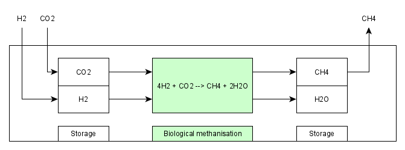

.. _model_methanisation_storage_electrolyzer:

~~~~~~~~~~~~~~~~~~~~~
Methanisation Storage
~~~~~~~~~~~~~~~~~~~~~

.. contents:: `Contents`
    :depth: 1
    :local:
    :backlinks: top
	
Scope
=====

This model was developed to implement a simplified model of a methanisation storage for energy system optimization with oemof.solph. 

Concept
=======

- scheme
- equations
- assumptions
- table with symbols

	
	Fig. 1: Model of the underground storage.
	
- Test
- Test2
