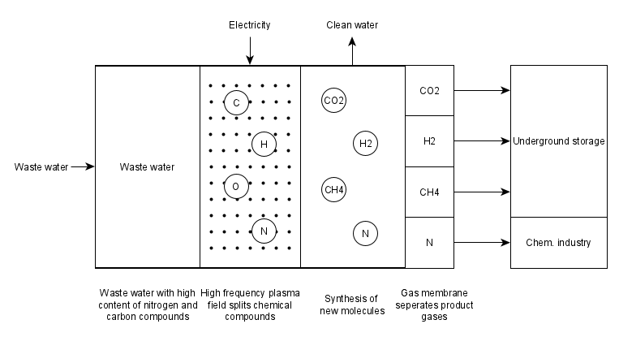

.. _model_plasmalyser:

~~~~~~~~~~~
Plasmalyser
~~~~~~~~~~~

.. contents:: `Contents`
    :depth: 1
    :local:
    :backlinks: top
	
Scope
=====

This model was developed to implement a simplified model of a plasmalyser for energy system optimization with oemof.solph. 

Concept
=======

- scheme
- process description
- equations
- assumptions
- table with symbols

	
	Fig. 1: Process of waste water plasmalysis.

Allgemein ist die Plasmalyse ein Prozess bei dem unter Nutzung eines Plasmafeldes chemische Verbindungen aufgespalten werden
(Plasma-chemische Dissoziation). Anschließend kommt es zur Bildung von neuen Molekülen durch die Synthese von zwei oder mehr 
Elementen.

Die Schmutzwasser-Plasmalyse nutzt Abwasser aus Klärwerken, Biogas- oder Industrieanlagen. Dieses Schmutzwasser (Brüdenwasser) hat
einen hohen Anteil an Stickstoff- und Kohlenstoffverbindungen, die jeweils Wasserstoff enthalten (z.B Ammoniak :math:`\text{NH}_4`) und 
so die Energieausbeute erhöhen.
Ein hochfrequentes Plasmafeld mit mehreren Tausend Kilovolt spaltet die Moleküle des Abwassers in einzelne C-, N-, H- und O-Atome 
auf. Die Atome liegen als ionisiertes Gas vor, innerhalb dessen sie sich neu verbinden. Es entstehen Wasserstoff, Kohlenstoffdioxid, 
Methan und Stickstoff. Die Gase können mit Hilfe einer Gasmembran getrennt und in Tanks gespeichert werden. Als Nebenprodukt bleibt 
gereinigtes Wasser zurück. Der Wasserstoff und das Kohlenstoffdioxid können in der biologischen Methanisierung verwertet werden. 
Das bereits gebildete Methan kann zusätzlich in den Speicher gebracht werden. Der reine Stickstoff lässt sich in der chemischen 
Industrie weiterverarbeiten. 